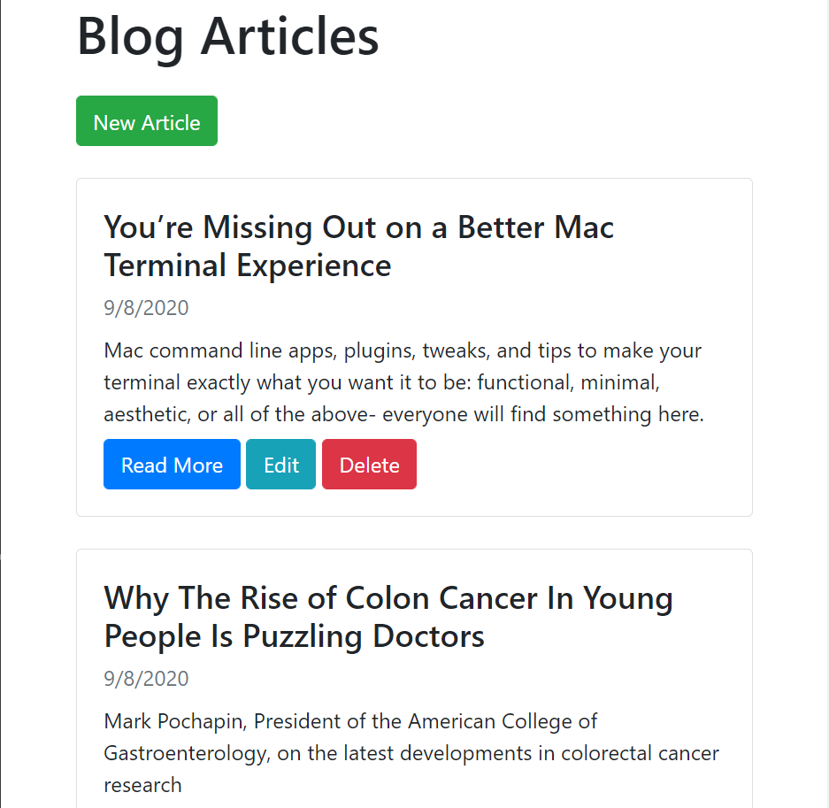

# blog-crud-app-nodeJS
## Simple CRUD app using nodeJS, mongoDB and express.js

This is a simple CRUD Blog app, its using mongodb atlas as its database.

### Cloning and Working: 
1. Clone the Project
2. in terminal run command, "npm install", which will install all the dependencies.
3. in terminal run commanf, "npm run devstart", to run the porject and open up the app on localhost 5000.
you can ofcourse change this command from package.json, under scripts replace devstart to whatever you want.
4. You need to create your own database from mongodb atlas. Refer their documentation.
5. In db folder and in connection.js file change the URI const, to your link. Mine wont work for you since your IP adress wont be whitelisted.
6. And again DONT forget to whitelist your IP address in networks tab.

This project was not focused on front-end so it will look boring. But you can always impove the frontend.

some images, again not pleasing :) - 

Index -

